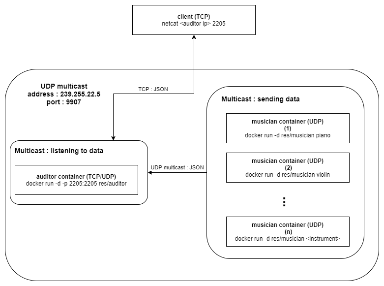

# Teaching-HEIGVD-RES-2020-Labo-Orchestra

## Admin

* **You can work in groups of 2 students**.
* It is up to you if you want to fork this repo, or if you prefer to work in a private repo. However, you have to **use exactly the same directory structure for the validation procedure to work**. 
* We expect that you will have more issues and questions than with other labs (because we have a left some questions open on purpose). Please ask your questions on Telegram / Teams, so that everyone in the class can benefit from the discussion.

## Objectives

This lab has 4 objectives:

* The first objective is to **design and implement a simple application protocol on top of UDP**. It will be very similar to the protocol presented during the lecture (where thermometers were publishing temperature events in a multicast group and where a station was listening for these events).

* The second objective is to get familiar with several tools from **the JavaScript ecosystem**. You will implement two simple **Node.js** applications. You will also have to search for and use a couple of **npm modules** (i.e. third-party libraries).

* The third objective is to continue practicing with **Docker**. You will have to create 2 Docker images (they will be very similar to the images presented in class). You will then have to run multiple containers based on these images.

* Last but not least, the fourth objective is to **work with a bit less upfront guidance**, as compared with previous labs. This time, we do not provide a complete webcast to get you started, because we want you to search for information (this is a very important skill that we will increasingly train). Don't worry, we have prepared a fairly detailed list of tasks that will put you on the right track. If you feel a bit overwhelmed at the beginning, make sure to read this document carefully and to find answers to the questions asked in the tables. You will see that the whole thing will become more and more approachable.


## Requirements

In this lab, you will **write 2 small NodeJS applications** and **package them in Docker images**:

* the first app, **Musician**, simulates someone who plays an instrument in an orchestra. When the app is started, it is assigned an instrument (piano, flute, etc.). As long as it is running, every second it will emit a sound (well... simulate the emission of a sound: we are talking about a communication protocol). Of course, the sound depends on the instrument.

* the second app, **Auditor**, simulates someone who listens to the orchestra. This application has two responsibilities. Firstly, it must listen to Musicians and keep track of **active** musicians. A musician is active if it has played a sound during the last 5 seconds. Secondly, it must make this information available to you. Concretely, this means that it should implement a very simple TCP-based protocol.


### Instruments and sounds

The following table gives you the mapping between instruments and sounds. Please **use exactly the same string values** in your code, so that validation procedures can work.

| Instrument | Sound         |
|------------|---------------|
| `piano`    | `ti-ta-ti`    |
| `trumpet`  | `pouet`       |
| `flute`    | `trulu`       |
| `violin`   | `gzi-gzi`     |
| `drum`     | `boum-boum`   |

### TCP-based protocol to be implemented by the Auditor application

* The auditor should include a TCP server and accept connection requests on port 2205.
* After accepting a connection request, the auditor must send a JSON payload containing the list of <u>active</u> musicians, with the following format (it can be a single line, without indentation):

```
[
  {
  	"uuid" : "aa7d8cb3-a15f-4f06-a0eb-b8feb6244a60",
  	"instrument" : "piano",
  	"activeSince" : "2016-04-27T05:20:50.731Z"
  },
  {
  	"uuid" : "06dbcbeb-c4c8-49ed-ac2a-cd8716cbf2d3",
  	"instrument" : "flute",
  	"activeSince" : "2016-04-27T05:39:03.211Z"
  }
]
```

### What you should be able to do at the end of the lab


You should be able to start an **Auditor** container with the following command:

```
$ docker run -d -p 2205:2205 res/auditor
```

You should be able to connect to your **Auditor** container over TCP and see that there is no active musician.

```
$ telnet IP_ADDRESS_THAT_DEPENDS_ON_YOUR_SETUP 2205
[]
```

You should then be able to start a first **Musician** container with the following command:

```
$ docker run -d res/musician piano
```

After this, you should be able to verify two points. Firstly, if you connect to the TCP interface of your **Auditor** container, you should see that there is now one active musician (you should receive a JSON array with a single element). Secondly, you should be able to use `tcpdump` to monitor the UDP datagrams generated by the **Musician** container.

You should then be able to kill the **Musician** container, wait 5 seconds and connect to the TCP interface of the **Auditor** container. You should see that there is now no active musician (empty array).

You should then be able to start several **Musician** containers with the following commands:

```
$ docker run -d res/musician piano
$ docker run -d res/musician flute
$ docker run -d res/musician flute
$ docker run -d res/musician drum
```
When you connect to the TCP interface of the **Auditor**, you should receive an array of musicians that corresponds to your commands. You should also use `tcpdump` to monitor the UDP trafic in your system.


## Task 1: design the application architecture and protocols

| #  | Topic |
| --- | --- |
|Question | How can we represent the system in an **architecture diagram**, which gives information both about the Docker containers, the communication protocols and the commands? |
| |  |
|Question | Who is going to **send UDP datagrams** and **when**? |
| | *Each musician will send an UDP diagram containing his uuid and instrument sound. They will do so every second.* |
|Question | Who is going to **listen for UDP datagrams** and what should happen when a datagram is received? |
| | *The auditor. When he receive a datagram, he will compare the uudi to his disctionnary of musicians. If they are not in it, he will create an entry containing instrument, creation date and last heard date. If they are already in it, the auditor will update the last heard date to the current time.* |
|Question | What **payload** should we put in the UDP datagrams? |
| | *At least the musician's uuid, and either his instrument, the sound it makes or both* |
|Question | What **data structures** do we need in the UDP sender and receiver? When will we update these data structures? When will we query these data structures? |
| | *We will use one `Map` in order to link each instrument to its' sound  on the musician side. The first `Map` is not to be updated. The auditor (receiver), on the other hand, needs a dictionnary containing heard musicians stored by uuid as key. He will update this data structure every time a musician a new musician is heard, every time a musician is heard again and every time a musician hasn't been heard in 5 seconds. We will query this data structure each time we connect to the auditor by TCP.* |


## Task 2: implement a "musician" Node.js application

| #  | Topic |
| ---  | --- |
|Question | In a JavaScript program, if we have an object, how can we **serialize it in JSON**? |
| | *By using the following command : ```JSON.stringify(object);```*  |
|Question | What is **npm**?  |
| | *It is a package manager. It is a tool kind of similar to **Maven** that will manage the **JS** project.* |
|Question | What is the `npm install` command and what is the purpose of the `--save` flag?  |
| | *```npm install``` : is used to add and install a package and any package it depends on\ ```--save``` : is used to add the given package to the dependency tree.* |
|Question | How can we use the `https://www.npmjs.com/` web site?  |
| | *This site is similar to *Docker Hub*, it can be used to search for packages, their documentation and the commands used to install them.* |
|Question | In JavaScript, how can we **generate a UUID** compliant with RFC4122? |
| | *With the **uuid** package. We used the *uuidv4* function for its' random ID generator.* |
|Question | In Node.js, how can we execute a function on a **periodic** basis? |
| | *With the following instruction : ```setInterval(`functionToExecutePeriodically`, waitingTimeInMilliseconds);```* |
|Question | In Node.js, how can we **emit UDP datagrams**? |
| | *With the **dgram** package and a UDP socket. We use the ```send``` method to which we give the message to send and the needed information (message length, port, id address etc) in order to send the **UDP datagram** version of the given payload.* |
|Question | In Node.js, how can we **access the command line arguments**? |
| | *By doing the following command : ```const someVariable = process.argv[x];``` (in this case, ```x``` is the index of the argument needed for the variable)* |


## Task 3: package the "musician" app in a Docker image

| #  | Topic |
| ---  | --- |
|Question | How do we **define and build our own Docker image**?|
| | *By creating a Dockerfile with the information we need from a chosen image and by adding some files if needed, and then by using the following command : ```docker build -t <image name> .```*  |
|Question | How can we use the `ENTRYPOINT` statement in our Dockerfile?  |
| | *It is similar to the `CMD`statemtent, exept it allows the container to be run as an executable (which can take starting arguments)*  |
|Question | After building our Docker image, how do we use it to **run containers**?  |
| | *With the following command : ```docker run <image name>```*  |
|Question | How do we get the list of all **running containers**?  |
| | *By using the ```docker ps``` command.*  |
|Question | How do we **stop/kill** one running container?  |
| | *``` docker stop <container id or name> ``` or ``` docker kill <container id or name> ```*  |
|Question | How can we check that our running containers are effectively sending UDP datagrams?  |
| | *By using WireShark or any other traffic sniffer.*  |


## Task 4: implement an "auditor" Node.js application

| #  | Topic |
| ---  | ---  |
|Question | With Node.js, how can we listen for UDP datagrams in a multicast group? |
| | *After declaring an udp4 socket, we can bind it to the correct port using udpSocket.bind(port, function() and subscribe to the multicast group address using udpSocket.addMembership(address);*  |
|Question | How can we use the `Map` built-in object introduced in ECMAScript 6 to implement a **dictionary**?  |
| | *A Map binds keys and values together. By using a musician's uuid as a key and his instrument and time information as values, we can retrieve those informations by knowing the uuid, using map.has(key), map.get(key) and map.set(key, value), which is a disctionary* |
|Question | How can we use the `Moment.js` npm module to help us with **date manipulations** and formatting?  |
| | *Moment.js lets us have readable date representations using moment().format() and store them as data. It also lets us get the difference between these representations and returns it to us as milliseconds, which we can use to measure elapsed time. Finally, the date are shown in UTC.* |
|Question | When and how do we **get rid of inactive players**?  |
| | *Every so often, we have to check every player registered for the last time we heard them. If that time is bigger than a constant, 5000 milliseconds in our case, we remove them from our dictionary. We chose to do this check every second for more theoretical accuracy, but we could have done this every 5 seconds, or even only when somebody requests the musicians to the auditor by TCP.* |
|Question | How do I implement a **simple TCP server** in Node.js?  |
| | *By using net with net.createServer(), we can easily create a TCP server on which we can define actions. By using tcpServer.listen(port), we listen for incoming connection on a specific port. By using tcpServer.on('connection', function(socket)), we can define what to do on a client initial connection. In our case, we send what we know about the orchestra with socket.write.* |


## Task 5: package the "auditor" app in a Docker image

| #  | Topic |
| ---  | --- |
|Question | How do we validate that the whole system works, once we have built our Docker image? |
| | *We validated our system the following way: We first launch one auditor container in foreground mode to see what is printed. We see that as expected, no music is heard. We can the launch several musician containers and see on the auditor container that it can effectively hear different musicians. Finally, we can use netcat to connect via TCP to our auditor and he will give us a list of musicians he heard in the last 5 seconds. We can then kill 1 by 1 the musicians and connect to the auditor again using netcat and see that the list grows shorter each time, removing the musician that we killed. By using the validate.sh script, we also had better confirmation that our system was correct.* |


## Constraints

Please be careful to adhere to the specifications in this document, and in particular

* the Docker image names
* the names of instruments and their sounds
* the TCP PORT number

Also, we have prepared two directories, where you should place your two `Dockerfile` with their dependent files.

Have a look at the `validate.sh` script located in the top-level directory. This script automates part of the validation process for your implementation (it will gradually be expanded with additional operations and assertions). As soon as you start creating your Docker images (i.e. creating your Dockerfiles), you should try to run it.
